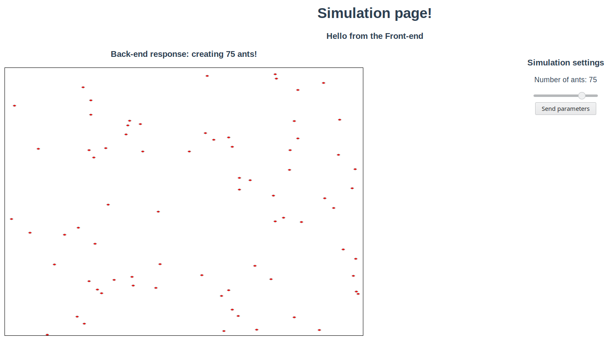

# Ant simulation web application
Repository containing a web application that simulates ants.
## Instructions to running back-end and front-end
### Creating the Back-end
1. Download NPM and Node.
2. Clone this repository.
3. Open your favorite code editor to the root of the project.
4. Run the following commands in a terminal that is open to the root's location.
```
npm i express
npm i body-parser
npm i -D nodemon
npm i cors
```
5. Start the server by running the following command in the terminal in the `server` directory.
```
npm run dev
```
Your server should be now running on `localhost:5000/api/sim`. Check the message in your browser as well as the logging in your terminal that ran the server.

Whenever you modify and save your code, `nodemon` will automatically restart the server so your changes will be visible in the browser immediately.

### Creating the Front-end
1. cd into /client
2. Run `npm i @vue/cli`
3. cd into /client
4. Run npm run serve

With both front-end and back-end running, go to `localhost:8080` to use the app. Currently, the state of the app looks as follows:

One is able to tweak parameters of the simulation by using sliders, as seen on the right-hand side of the app. The data is sent to the back-end where the simulation is running. The client sends the parameters and the back-end creates the model of the ants with the desired parameters. On the canvas we see ant objects with properties, displayed as red circles.

## Inspiration
https://curran.github.io/HTML5Examples/
